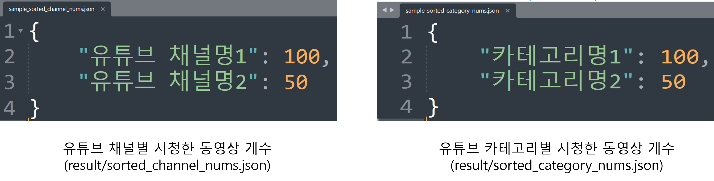

# youtube_history_analyzer
구글의 [Takeout](https://takeout.google.com/settings/takeout)과 [YouTube Data API v3](https://developers.google.com/youtube/v3/docs)를 이용하여 카테고리 및 채널별로 시청한 유튜브 동영상 개수를 JSON 파일로 생성하는 프로젝트입니다.

<br/>

## 결과 예시


* 카테고리 정보는 data 폴더 내 [category_id_name_mapper.json](data/category_id_name_mapper.json) 파일에서 확인할 수 있습니다. 
<br/>
* 구조: {카테고리 id 값 : 카테고리 명}
<br/>
* 출처: https://developers.google.com/youtube/v3/docs/videoCategories/list

<br/>

## 설치
* [python3](https://www.python.org/downloads)
* [구글 Takeout](https://takeout.google.com/settings/takeout)
* [YouTube Data API v3](https://developers.google.com/youtube/v3/docs)

<br/>

## 사용법
1. 다운받은 zip 파일을 압축 해제 하여 'YouTube 및 YouTube Music/시청기록/시청 기록.html' 파일을 watch-history.html로 이름을 변경합니다.
2. watch-history.html 파일을 프로젝트의 data 폴더에 추가합니다.
3. 프로젝트 루트 폴더에서 다음의 명령어를 실행하여 필요한 모듈을 설치합니다.
```
 pip install -r requirements.txt
```
4. analyze.py에서 DEVELOPER_KEY 값을 자신의 [구글 API 키](https://support.google.com/googleapi/answer/6158862?hl=en)로 변경합니다.
5. analyze.py 파일을 실행합니다.
6. 결과는 result 폴더에 json 형식으로 생성됩니다.
   * sorted_category_name_nums.json: 카테고리별 시청한 동영상의 개수입니다.
   * sorted_channel_nums.json: 채널별 시청한 동영상의 개수입니다.

<br/>

## 한계
1. 시청한 영상의 시청 시간을 알 수 없습니다.
2. 시청한 영상이 광고 영상인 지의 여부를 구분할 수 없습니다.
3. '홈에서 자동 재생' 기능을 통해 재생된 영상인 지의 여부를 확인할 수 없습니다.
4. 주된 원인은 Youtube API에서 제공하는 정보의 한계입니다. 이에 Youtube API에서 관련 정보를 제공하면 반영토록 하겠습니다. 
